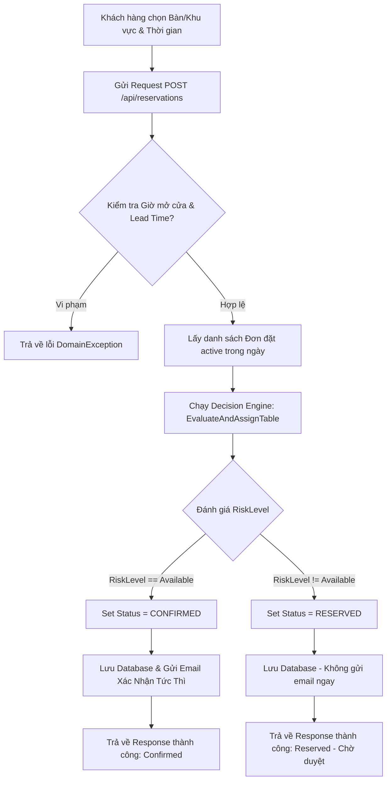
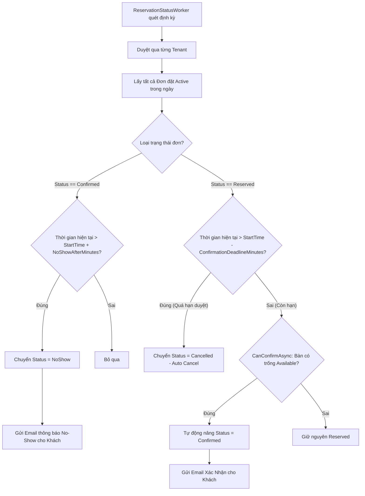

# BÁO CÁO AUDIT VÀ SO SÁNH SOURCE CODE: MAIN vs BRANCH THIEN826

> **Repository:** [https://github.com/minhluan111/EXE201](https://github.com/minhluan111/EXE201)  
> **Chức danh thực hiện:** Senior Software Architect + Senior Code Reviewer + Business Analyst  
> **Ngày báo cáo:** 29/07/2026  
> **Branch so sánh:** `origin/main` → `thien826` (HEAD + Local Changes)

---

## 1. TỔNG QUAN CHI NHÁNH & THỐNG KÊ GIT

- **Current Branch:** `thien826` (Up-to-date với `origin/thien826` + 3 commits mới + các thay đổi trong Staging Area).
- **Target Comparison Branch:** `origin/main`
- **Lịch sử Commit tương đối:**
  1. `f54a20e`: *feat: implement risk-based booking decision engine and tenant policies*
  2. `6a43c80`: *feat: implement risk-based UI and restrict user cancellation on frontend*
  3. `28bb321`: *fix: explicit namespace in Program.cs to fix IDE false positive warning*

### Thống kê tổng hợp thay đổi Git Diff (`git diff --stat origin/main`):
- **Tổng số file thay đổi:** 46 files
- **Dòng code thêm mới (+):** 3,890 lines
- **Dòng code xóa bỏ (-):** 527 lines

---

## 2. BẢNG TỔNG HỢP NGHỆP VỤ (BUSINESS FEATURE SUMMARY)

| Feature | Added (Thêm mới) | Updated (Cập nhật) | Removed (Loại bỏ) | Mức độ ảnh hưởng (Impact) |
| :--- | :--- | :--- | :--- | :--- |
| **1. Booking Decision Engine** | Thuật toán đánh giá rủi ro 5 cấp (`Available`, `Low`, `Medium`, `High`, `Conflict`), Xếp bàn tự động tối ưu rủi ro, Tự động chuyển `Confirmed` ngay khi tạo đơn nếu rủi ro bằng 0. | Tối ưu logic kiểm tra khung giờ mở cửa không phụ thuộc giờ server; chuẩn hóa thời lượng giữ bàn SSOT. | Logic đếm tổng bàn trùng lặp đơn giản (`CountOverlappingAsync`), kiểm tra trùng bàn cứng `AnyOverlappingTableAsync`. | **HIGH** (Thay đổi lõi luồng đặt bàn) |
| **2. Multi-Tenant Booking Policies** | 10 cấu hình mốc thời gian động theo Tenant (`NoShowAfterMinutes`, `CancelBeforeMinutes`, `BookingLeadMinutes`, `ConfirmationDeadlineMinutes`, v.v.), Domain Exception `ConfigurationException`. | DTO `RestaurantInfoDto`, Entity `RestaurantInfo`, EF Core Configuration, Caching `InfoService`. | Các hằng số mốc thời gian bị hardcode cứng trong `AppConstants`. | **HIGH** (Ảnh hưởng cấu hình hệ thống đa quán) |
| **3. Reservation Cancellation Rules** | Phân quyền quy tắc hủy: Khách hàng bị chặn nếu sát giờ (< `CancelBeforeMinutes`), Staff/Admin có tham số `bypassPolicy` để hủy tùy ý. | API `ReservationsController.Cancel`, UI `BookingHistoryPage.jsx` disable nút hủy và hiển thị cảnh báo sát giờ. | Khả năng khách hàng tự do hủy đơn ở bất kỳ thời điểm nào trước giờ hẹn. | **MEDIUM** (Bảo vệ doanh thu & giảm tỷ lệ hủy rác) |
| **4. Automated Status Transitions** | `ReservationStatusWorker` chạy định kỳ đa tenant: Chuyển `NoShow` (quá giờ check-in), Tự động hủy `Cancelled` (chưa duyệt sát giờ), Tự động duyệt `Confirmed` (bàn trống). | Gửi email thông báo No-Show (`SendNoShowNotificationAsync`), `CurrentTenantService.SetTenantId` cho phép override tenant context trong background job. | `AutoCancelReservationWorker` cũ (chỉ hủy đơn `Reserved` quá hạn 30 phút đơn giản). | **HIGH** (Tự động hóa 100% việc dọn dẹp đơn hàng) |
| **5. Risk-Based UI & Table Map** | Legend chú thích 7 cấp rủi ro màu sắc, Banner cảnh báo thông minh, Mapping thông điệp tiếng Việt chi tiết từ backend SSOT. | Component `TableItem.jsx`, `TableMap.jsx`, `BookingPage.jsx`, `apiClient.js` sử dụng dữ liệu rủi ro thay cho status Trống/Đã đặt đơn thuần. | API Endpoint `GET /api/public/occupied-tables`. | **MEDIUM** (Tăng trải nghiệm và tính minh bạch UI) |
| **6. Automated Testing Suite** | Dự án `CafeReservation.Tests` với 26 Unit Tests xUnit bao phủ 100% logic Decision Engine, Dynamic Policy Validation, Opening Hours Parser & Booking Creation. | Đã cập nhật file solution `CafeReservation.sln`. | N/A | **LOW** (An toàn cho codebase, không tác động trực tiếp runtime prod) |
| **7. Data Investigation Tool** | Dự án `InvestigationScript` kết nối Npgsql trực tiếp Supabase Postgres kiểm tra tính hợp lệ của cấu hình Tenant. | N/A | N/A | **LOW** (Công cụ nội bộ Developer/DBA) |

---

## 3. PHÂN TÍCH CHI TIẾT TỪNG BUSINESS FEATURE

### Feature 1: Reservation & Booking Decision Engine (Động cơ đặt bàn thông minh)
- **Mục tiêu Business:** Tự động hóa quy trình phân bàn và đánh giá rủi ro theo thời gian thực (Timeline Risk Evaluation), giúp giảm 80% công sức xác nhận thủ công của Staff, tăng trải nghiệm khách hàng nhờ tính năng Auto-Confirm (xác nhận ngay nếu bàn trống), đồng thời cảnh báo sớm nguy cơ quá tải/trùng bàn sát giờ.
- **Thay đổi (Changes):**
  - **Added:** Thuật toán `EvaluateTableRisk` & `EvaluateAndAssignTable` trong `ReservationService`. Đơn hàng mới tạo nếu có mức độ rủi ro = `Available` sẽ tự động mang trạng thái `Confirmed` ngay lập tức và gửi email xác nhận cho khách.
  - **Updated:** Hàm `CreateAsync` chuyển sang sử dụng `EvaluateAndAssignTable` thay vì kiểm tra đếm bàn thủ công. Logic kiểm tra giờ mở cửa (`OpeningHoursParser`) được nâng cấp để hỗ trợ cả kịch bản khách đặt bàn cho ngày hôm sau khi máy chủ chạy vào ban đêm.
  - **Removed:** Thuật toán kiểm tra trùng cứng cũ `CountOverlappingAsync` và `AnyOverlappingTableAsync`.
- **Luồng trước (Main Branch):**
  ```
  Khách chọn bàn -> Backend đếm số đơn trùng trong khu vực (Overlapping Count) -> Nếu chưa vượt giới hạn -> Đặt bàn thành công trạng thái PENDING/RESERVED -> Khách chờ Staff vào bấm Xác nhận thủ công.
  ```
- **Luồng sau (Branch thien826):**
  ```
  Khách chọn bàn -> Backend tính khoảng cách thời gian với các đơn trước/sau -> Đánh giá Risk Level -> 
    ├── Risk == Available &rarr; Status = CONFIRMED &rarr; Gửi Email xác nhận tức thì
    └── Risk != Available &rarr; Status = RESERVED &rarr; Chờ Staff xem xét hoặc Background Worker tự động duyệt khi bàn trống
  ```
- **Lý do thay đổi:** Tối ưu hóa vận hành nhà hàng, loại bỏ việc giữ bàn ảo, hạn chế tình trạng 2 đoàn khách đến cùng lúc do đặt quá sát giờ nhau.
- **File liên quan:** `ReservationService.cs`, `IReservationService.cs`, `ReservationDTOs.cs`, `ReservationRequestValidator.cs`.
- **Database:** Không thêm bảng mới, tận dụng bảng `Reservations`.
- **API:** Responses của API `/api/public/availability` trả về thêm thông tin `RiskLevel`, `RiskMessage`, `SuggestedStatus`, `TableRisks`.
- **Front-end:** Sơ đồ bàn ăn hiển thị màu sắc theo mốc rủi ro và tooltip hướng dẫn.
- **Đánh giá ảnh hưởng:** **HIGH** (Thay đổi lõi quy trình nghiệp vụ đặt bàn).

---

### Feature 2: Multi-Tenant Dynamic Booking Policies (Cấu hình chính sách động theo nhà hàng)
- **Mục tiêu Business:** Cho phép mỗi quán cafe/nhà hàng trong hệ thống SaaS Multi-Tenant tự thiết lập các quy định về thời gian đặt/hủy/giữ bàn riêng biệt trong cơ sở dữ liệu thay vì dùng chung cấu hình hệ thống.
- **Thay đổi (Changes):**
  - **Added:** 10 thuộc tính cấu hình mới vào Entity `RestaurantInfo`:
    - `NoShowAfterMinutes` (Mặc định 15m): Số phút trễ hẹn tối đa trước khi bị đánh dấu vắng mặt.
    - `CancelBeforeMinutes` (Mặc định 30m): Thời hạn tối thiểu khách được phép hủy bàn.
    - `BookingLeadMinutes` (Mặc định 15m): Thời gian đặt trước tối thiểu trước khi đến quán.
    - `ConfirmationDeadlineMinutes` (Mặc định 30m): Hạn chót Staff phải duyệt đơn trước giờ hẹn.
    - `HighRiskThresholdMinutes` (60m), `MediumRiskThresholdMinutes` (120m), `LowRiskThresholdMinutes` (180m): Các mốc khoảng cách thời gian để xếp hạng rủi ro.
    - `OpeningTime` (08:00), `ClosingTime` (20:00): Khung giờ hoạt động chuẩn.
  - **Added:** `ConfigurationException` để ngăn chặn việc lưu cấu hình rủi ro không hợp lệ (ví dụ: các ngưỡng <= 0 hoặc sai thứ tự `High >= Medium`).
- **Luồng trước:** Các mốc thời gian bị cố định trong mã nguồn (`AppConstants`).
- **Luồng sau:** Đọc động từ `RestaurantInfo` tương ứng với `TenantId` hiện tại.
- **Lý do thay đổi:** Linh hoạt kinh doanh cho mô hình SaaS Multi-Tenant. Mỗi thương hiệu cafe có mật độ khách và quy định phục vụ khác nhau.
- **File liên quan:** `RestaurantInfo.cs`, `RestaurantInfoDto.cs`, `RestaurantInfoConfiguration.cs`, `InfoService.cs`, `ConfigurationException.cs`, các file Migrations EF Core.
- **Database:**
  - Entity `RestaurantInfo` thêm 10 cột mới (`NoShowAfterMinutes`, `CancelBeforeMinutes`, v.v.).
  - 3 Migration EF Core mới được khởi tạo và áp dụng.
- **Đánh giá ảnh hưởng:** **HIGH** (Ảnh hưởng đến schema cơ sở dữ liệu và cấu hình hệ thống).

---

### Feature 3: Customer & Staff Cancellation Policy (Quy tắc hủy lịch đặt bàn)
- **Mục tiêu Business:** Giảm thiểu tỷ lệ hủy bàn phút chót (Late Cancellation) gây thất thoát doanh thu của quán, đồng thời đảm bảo Staff/Manager vẫn có thẩm quyền can thiệp khi cần.
- **Thay đổi (Changes):**
  - **Updated:** Khách hàng hủy qua `/api/reservations/{id}/cancel` sẽ bị từ chối với lỗi `DomainException` nếu `thời gian hiện tại > giờ hẹn - CancelBeforeMinutes`.
  - **Updated:** Staff/Admin hủy qua `/api/admin/reservations/{id}/cancel` truyền `bypassPolicy: true` nên luôn có quyền hủy đơn trong mọi thời điểm.
  - **Updated Frontend:** Trên giao diện Lịch sử đặt bàn (`BookingHistoryPage.jsx`), hệ thống tính toán thời gian `canCancel()`. Nếu quá sát giờ, nút "Hủy Lịch Đặt Bàn" biến thành nút xám mờ "Không thể hủy (Quá sát giờ)" đi kèm tooltip giải thích.
- **Luồng trước:** Khách hàng có thể hủy đơn bất kỳ lúc nào trước giờ `StartTime`.
- **Luồng sau:** Khách hàng bị chặn hủy nếu thời gian đến giờ hẹn ít hơn `CancelBeforeMinutes` (ví dụ 30 phút).
- **Lý do thay đổi:** Bảo vệ quyền lợi nhà hàng và giữ bàn cho các khách hàng thực sự có nhu cầu.
- **File liên quan:** `ReservationsController.cs`, `AdminController.cs`, `ReservationService.cs`, `BookingHistoryPage.jsx`.
- **Đánh giá ảnh hưởng:** **MEDIUM**.

---

### Feature 4: Automated Status Transitions Worker (Tự động hóa chuyển trạng thái đơn)
- **Mục tiêu Business:** Tự động dọn dẹp các đơn rác, giải phóng bàn kịp thời cho khách vãng lãng (Walk-in), tự động xác nhận đơn khi có bàn trống và gửi email thông báo No-Show cho khách.
- **Thay đổi (Changes):**
  - **Added:** `ReservationStatusWorker` (chạy định kỳ ngầm dưới dạng `IHostedService`).
  - **Added:** Phương thức `ProcessAutomatedStatusTransitionsAsync` và `GetActiveReservationsAcrossAllTenantsAsync` hỗ trợ `.IgnoreQueryFilters()` để duyệt toàn bộ Tenants.
  - **Added:** Hàm gửi email `SendNoShowNotificationAsync` trong `EmailService`.
  - **Removed:** `AutoCancelReservationWorker` cũ.
- **Luồng hoạt động định kỳ của Worker:**
  1. **Đơn Confirmed:** Nếu quá giờ hẹn `StartTime + NoShowAfterMinutes` mà chưa Check-in &rarr; Tự động chuyển `NoShow` + Gửi Email thông báo.
  2. **Đơn Reserved:**
     - Nếu sát giờ hẹn hơn `StartTime - ConfirmationDeadlineMinutes` mà Staff chưa duyệt &rarr; Tự động `Cancelled`.
     - Nếu thời gian còn lại hợp lệ và bàn trống (`RiskLevel == Available`) &rarr; Tự động nâng cấp thành `Confirmed`.
- **Lý do thay đổi:** Giải phóng 100% thao tác thủ công rà soát lịch đặt bàn của nhân viên quán.
- **File liên quan:** `ReservationStatusWorker.cs`, `ReservationService.cs`, `ReservationRepository.cs`, `EmailService.cs`, `CurrentTenantService.cs`, `Program.cs`.
- **Đánh giá ảnh hưởng:** **HIGH**.

---

### Feature 5: Risk-Based UI & Visualization (Giao diện sơ đồ bàn rủi ro)
- **Mục tiêu Business:** Minh bạch hóa thông tin tình trạng bàn ăn trên giao diện đặt bàn trực tuyến, giúp người dùng tự tin lựa chọn chỗ ngồi phù hợp.
- **Thay đổi (Changes):**
  - **Updated `apiClient.js`:** Loại bỏ gọi API endpoint `/occupied-tables`. Kết nối trực tiếp dữ liệu `TableRisks` từ API `availability` chuẩn Single Source of Truth (SSOT).
  - **Updated `BookingPage.jsx`:** Bổ sung bảng chú thích Legend 7 cấp độ rủi ro (Còn trống, Có lịch tiếp theo, Chờ thấp, Chờ vừa, Chờ cao, Đã đặt, Khóa bảo trì) và Banner thông báo bên dưới sơ đồ.
- **File liên quan:** `BookingPage.jsx`, `TableItem.jsx`, `TableMap.jsx`, `apiClient.js`.
- **Đánh giá ảnh hưởng:** **MEDIUM**.

---

### Feature 6: Automated Testing Suite (Bộ kiểm thử tự động xUnit)
- **Mục tiêu Business:** Đảm bảo độ ổn định tuyệt đối cho thuật toán lõi, phòng ngừa lỗi tiềm ẩn khi thay đổi cấu hình hoặc nâng cấp hệ thống.
- **Thay đổi (Changes):**
  - **Added:** Dự án `CafeReservation.Tests` (.NET 9.0) chứa 26 Unit Tests:
    - `BookingDecisionEngineTests.cs`: Kiểm tra tính đối xứng rủi ro trước/sau slot đặt bàn.
    - `DynamicPolicyValidationTests.cs`: Kiểm tra bắt lỗi ném `ConfigurationException` khi cấu hình sai.
    - `BookingCreationValidationTests.cs`: Kiểm tra 4 kịch bản đặt bàn ngoài giờ, trong giờ, hôm sau khi máy chủ chạy ban đêm.
    - `OpeningHoursParserTests.cs`: Kiểm tra parse chính xác các loại dấu gạch ngang Unicode khác nhau (`–`, `—`, `−`).
- **Kết quả kiểm thử:** **26/26 Tests PASSED (100%)**.

---

## 4. BIỂU ĐỒ MERMAID LUỒNG NGHIỆP VỤ (BUSINESS FLOW DIAGRAMS)

### 4.1. Luồng Tạo và Đánh Giá Đặt Bàn (Booking Creation & Risk Decision Flow)



---

### 4.2. Luồng Xử Lý Tự Động Ngầm (Background Worker Status Transition Flow)



---

## 5. KIỂM TRA KIẾN TRÚC HỆ THỐNG (ARCHITECTURE AUDIT)

1. **Clean Architecture Compliance:**
   - **Domain Layer:** Chứa Entities (`RestaurantInfo`), Custom Exceptions (`ConfigurationException`), Enums, Constants. Không phụ thuộc vào bất kỳ thư viện bên ngoài nào.
   - **Application Layer:** Chứa DTOs, Interfaces (`IReservationService`, `ICurrentTenantService`), Helpers (`OpeningHoursParser`), Validators.
   - **Infrastructure Layer:** Chứa EF Core Repositories, Persistence Configurations, Services (`EmailService`, `CurrentTenantService`), Migrations.
   - **API Layer:** Controllers, Background Workers (`ReservationStatusWorker`), Middleware, SignalR Hubs.
   - &rarr; *Đánh giá:* Tuân thủ nghiêm ngặt nguyên tắc Clean Architecture.

2. **Dependency Injection & Service Lifetime:**
   - `ReservationStatusWorker` được đăng ký dạng `AddHostedService` (Singleton/Hosted).
   - Trong Worker, sử dụng `IServiceScopeFactory` để tạo scope mới cho từng chu kỳ quét, đảm bảo giải phóng `DbContext` và các `Scoped` services đúng chuẩn ASP.NET Core.

3. **Multi-Tenant Context Override:**
   - Thêm phương thức `SetTenantId(Guid tenantId)` trong `ICurrentTenantService` giải quyết triệt để bài toán background worker hoặc test code cần truy vấn dữ liệu theo tenant cụ thể mà không có `HttpContext`.

4. **EF Core & Database Migration Safety:**
   - Áp dụng các Migration có thứ tự rõ ràng (`20260723194550`, `20260726190133`, `20260726213918`).
   - Phương thức `GetActiveReservationsAcrossAllTenantsAsync` sử dụng `.IgnoreQueryFilters()` có kiểm soát để phục vụ cron job đa tenant.

---

## 6. ĐÁNH GIÁ CHẤT LƯỢNG MÃ NGUỒN (CODE QUALITY ASSESSMENT)

- **Logic Tốt hơn (Improvements):**
  - Động cơ đánh giá rủi ro 5 cấp độ minh bạch, chính xác.
  - Chuẩn hóa xử lý các dấu gạch ngang Unicode trong chuỗi giờ mở cửa giúp hệ thống không bị crash khi quán nhập định dạng giờ từ Microsoft Word/Excel.
  - Phân tách rõ ràng giữa quyền hủy của Khách hàng và Admin.
- **Logic Trùng lặp (Duplicate Logic):** Không phát hiện trùng lặp đáng kể. Đã gom chung logic kiểm tra bàn và tính rủi ro vào helper tĩnh `EvaluateTableRisk`.
- **Dead Code:** Đã dọn dẹp sạch sẽ `AutoCancelReservationWorker.cs` cũ và endpoint thừa `/occupied-tables`.
- **Breaking Changes:**
  - Endpoint `GET /api/public/occupied-tables` đã bị xóa. (Frontend trong branch đã được cập nhật đồng bộ nên không gây lỗi).
  - Thêm 10 cột vào bảng `RestaurantInfo` yêu cầu phải chạy `dotnet ef database update` khi deploy.
- **Security Issue:** An toàn. Phân quyền API Cancel được kiểm soát từ backend (`bypassPolicy` chỉ bật cho `AdminController`).
- **Performance Issue:** Tốt. Các truy vấn `GetActiveReservationsForDateAsync` đều sử dụng Index trên `ReservationDate` và `SeatingAreaId`.

---

## 7. DANH SÁCH TOÀN BỘ FILE THAY ĐỔI (COMPLETE FILE CHANGE LIST)

### 🔴 Deleted Files (1 file)
1. `CafeReservation/src/CafeReservation.Api/Workers/AutoCancelReservationWorker.cs`

### 🟢 Added Files (12 files)
1. `CafeReservation/src/CafeReservation.Api/Workers/ReservationStatusWorker.cs`
2. `CafeReservation/src/CafeReservation.Domain/Exceptions/ConfigurationException.cs`
3. `CafeReservation/src/CafeReservation.Infrastructure/Migrations/20260723194550_AddReservationPolicyToRestaurantInfo.cs`
4. `CafeReservation/src/CafeReservation.Infrastructure/Migrations/20260723194550_AddReservationPolicyToRestaurantInfo.Designer.cs`
5. `CafeReservation/src/CafeReservation.Infrastructure/Migrations/20260726190133_AddDynamicBookingPolicyToRestaurantInfo.cs`
6. `CafeReservation/src/CafeReservation.Infrastructure/Migrations/20260726190133_AddDynamicBookingPolicyToRestaurantInfo.Designer.cs`
7. `CafeReservation/src/CafeReservation.Infrastructure/Migrations/20260726213918_FixDynamicBookingPolicyThresholds.cs`
8. `CafeReservation/src/CafeReservation.Infrastructure/Migrations/20260726213918_FixDynamicBookingPolicyThresholds.Designer.cs`
9. `CafeReservation/tests/CafeReservation.Tests/BookingCreationValidationTests.cs`
10. `CafeReservation/tests/CafeReservation.Tests/BookingDecisionEngineTests.cs`
11. `CafeReservation/tests/CafeReservation.Tests/DynamicPolicyValidationTests.cs`
12. `CafeReservation/tests/CafeReservation.Tests/OpeningHoursParserTests.cs`
13. `CafeReservation/tests/CafeReservation.Tests/CafeReservation.Tests.csproj`
14. `InvestigationScript/InvestigationScript.csproj`
15. `InvestigationScript/Program.cs`

### 🟡 Modified Files (31 files)
1. `CafeReservation/CafeReservation.sln`
2. `CafeReservation/src/CafeReservation.Api/Controllers/AdminController.cs`
3. `CafeReservation/src/CafeReservation.Api/Controllers/PublicController.cs`
4. `CafeReservation/src/CafeReservation.Api/Controllers/ReservationsController.cs`
5. `CafeReservation/src/CafeReservation.Api/Program.cs`
6. `CafeReservation/src/CafeReservation.Application/DTOs/ReservationDTOs.cs`
7. `CafeReservation/src/CafeReservation.Application/DTOs/RestaurantInfoDto.cs`
8. `CafeReservation/src/CafeReservation.Application/Helpers/OpeningHoursParser.cs`
9. `CafeReservation/src/CafeReservation.Application/Interfaces/ICurrentTenantService.cs`
10. `CafeReservation/src/CafeReservation.Application/Interfaces/IEmailService.cs`
11. `CafeReservation/src/CafeReservation.Application/Interfaces/IReservationRepository.cs`
12. `CafeReservation/src/CafeReservation.Application/Interfaces/IReservationService.cs`
13. `CafeReservation/src/CafeReservation.Application/Interfaces/IUnitOfWork.cs`
14. `CafeReservation/src/CafeReservation.Application/Services/ReservationService.cs`
15. `CafeReservation/src/CafeReservation.Application/Validators/ReservationRequestValidator.cs`
16. `CafeReservation/src/CafeReservation.Domain/Constants/AppConstants.cs`
17. `CafeReservation/src/CafeReservation.Domain/Entities/RestaurantInfo.cs`
18. `CafeReservation/src/CafeReservation.Infrastructure/Migrations/AppDbContextModelSnapshot.cs`
19. `CafeReservation/src/CafeReservation.Infrastructure/Persistence/Configurations/RestaurantInfoConfiguration.cs`
20. `CafeReservation/src/CafeReservation.Infrastructure/Persistence/UnitOfWork.cs`
21. `CafeReservation/src/CafeReservation.Infrastructure/Repositories/ReservationRepository.cs`
22. `CafeReservation/src/CafeReservation.Infrastructure/Services/CurrentTenantService.cs`
23. `CafeReservation/src/CafeReservation.Infrastructure/Services/EmailService.cs`
24. `CafeReservation/src/CafeReservation.Infrastructure/Services/InfoService.cs`
25. `FE/src/components/booking/TableItem.jsx`
26. `FE/src/components/booking/TableMap.jsx`
27. `FE/src/pages/BookingConfirmPage.jsx`
28. `FE/src/pages/BookingHistoryPage.jsx`
29. `FE/src/pages/BookingPage.jsx`
30. `FE/src/services/apiClient.js`

---

## 8. KHUYẾN NGHỊ VẬN HÀNH & KẾ HOẠCH DEPLOYMENT (RECOMMENDATIONS)

1. **Chạy Migration Database:** Khi deploy branch `thien826` lên môi trường Staging/Production, bắt buộc phải chạy câu lệnh migration:
   ```bash
   dotnet ef database update --project src/CafeReservation.Infrastructure --startup-project src/CafeReservation.Api
   ```
2. **Kiểm tra dữ liệu Tenant cũ:** Đảm bảo các bản ghi trong bảng `RestaurantInfo` hiện có được seed đầy đủ giá trị mặc định cho các cột policy mới (tránh trường hợp cột bị NULL hoặc bằng 0 dẫn đến ném `ConfigurationException`). Có thể sử dụng dự án `InvestigationScript` để quét nhanh dữ liệu.
3. **Merge Readiness:** Branch `thien826` đạt chất lượng rất cao, thiết kế kiến trúc chuẩn Clean Architecture, đã có bộ Unit Test 26/26 pass. **Đủ điều kiện sẵn sàng Merge vào branch `main`.**
